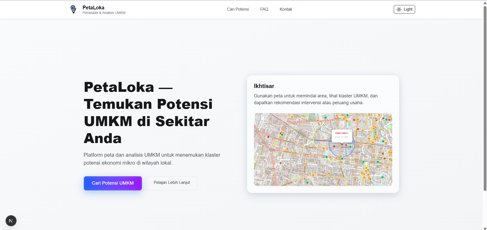
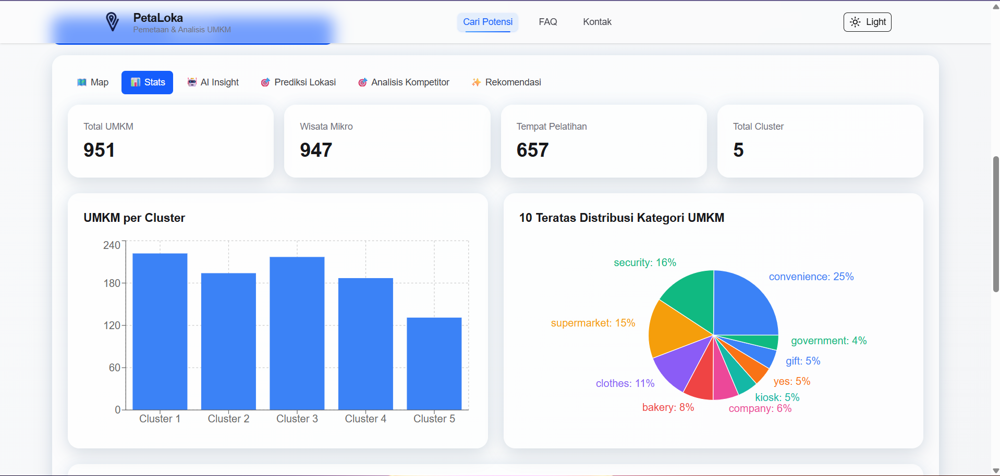
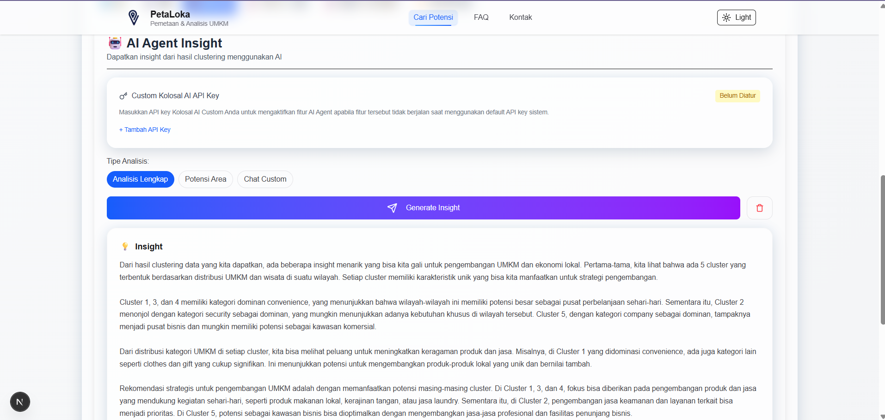
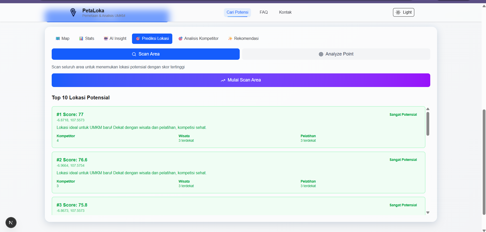
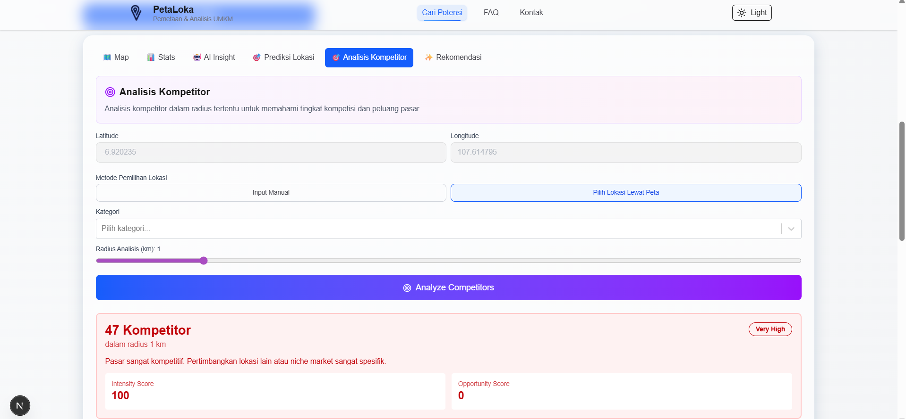
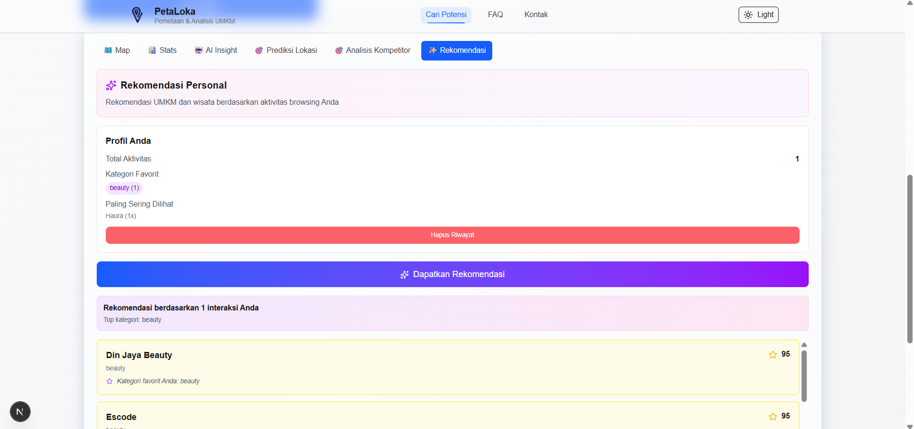
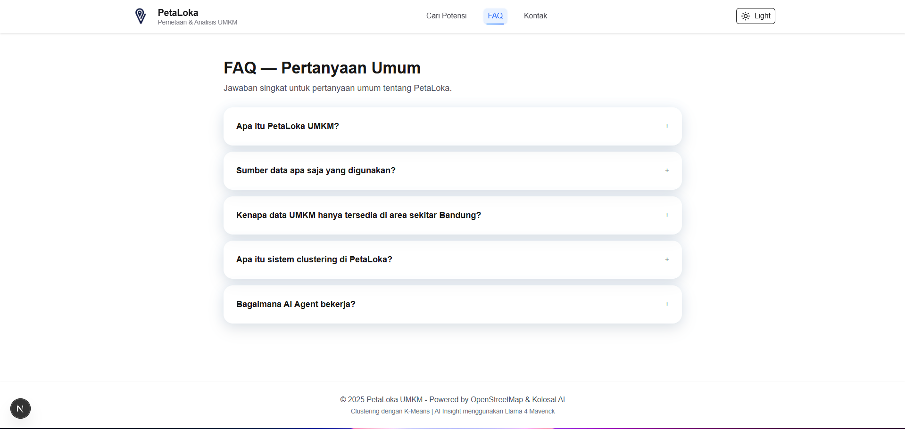

# PetaLoka


PetaLoka adalah platform pemetaan dan analisis untuk UMKM, yang menggabungkan data lokasi, clustering geografis, dan model AI untuk menghasilkan insight strategis. Aplikasi ini memanfaatkan data dari OpenStreetMap, Supabase, dan layanan AI untuk rekomendasi lokasi, analisis kompetitor, dan visualisasi peta interaktif.

## Daftar Isi

- [Ringkasan](#ringkasan)
- [Quickstart](#quickstart)
- [Demo](#demo)
- [Fitur Utama](#fitur-utama)
- [Arsitektur & Tech Stack](#arsitektur--tech-stack)
- [Kontribusi](#kontribusi)
- [Lisensi](#lisensi)
- [Atribusi](#atribusi)
- [Dokumentasi](#dokumentasi)

## Ringkasan

PetaLoka membantu pemangku kepentingan untuk:

- Memvisualisasikan distribusi UMKM dan titik-titik potensial
- Mengelompokkan (clustering) titik-titik UMKM untuk analisis wilayah
- Menghasilkan rekomendasi lokasi potensial dan analisis kompetitor berbasis AI
- Menyajikan dashboard statistik dan peta interaktif untuk pengambilan keputusan

## Quickstart

**Prasyarat**

- Node.js (disarankan v18 atau lebih baru)
- NPM atau PNPM/Yarn
- Akun Supabase (untuk menyimpan data)

**Langkah Instalasi**

1. Clone repositori

```bash
git clone https://github.com/aogz24/peta-loka.git
cd peta-loka
```

2. Install dependensi

```bash
npm install
```

3. Siapkan variabel lingkungan

Buat file `.env` di root dan tambahkan minimal variabel berikut:

```env
# Kolosal / AI provider
KOLOSAL_API_KEY=YOUR_API_KEY

# Supabase
NEXT_PUBLIC_SUPABASE_URL=https://your-project.supabase.co
NEXT_PUBLIC_SUPABASE_ANON_KEY=YOUR_ANON_KEY

# Konfigurasi peta (opsional)
NEXT_PUBLIC_MAP_CENTER_LAT=-6.9147418
NEXT_PUBLIC_MAP_CENTER_LNG=107.614526
NEXT_PUBLIC_MAP_ZOOM=12
```

4. Migrasi data ke Supabase (opsional, jika ingin mengisi DB dari file lokal)

```bash
npm run migrate
```

5. Jalankan server pengembangan

```bash
npm run dev
```

Buka http://localhost:3000

**Build untuk production**

```bash
npm run build
npm run start
```

## Demo

**Screenshot aplikasi:**











**Video demo Aplikasi:**


## Fitur Utama

- **Peta Interaktif** - Visualisasi marker untuk UMKM, wisata, dan pelatihan
- **Clustering Geografis** - K-Means clustering untuk identifikasi zona UMKM
- **Prediksi Lokasi** - Rekomendasi lokasi potensial berdasarkan densitas kompetitor, jarak ke wisata, dan akses pelatihan
- **Analisis Kompetitor** - Evaluasi level saturasi pasar dan competitive intelligence
- **AI Insight** - Panel AI untuk insight dan rekomendasi strategi (Kolosal AI / OpenAI)
- **Dashboard Statistik** - Visualisasi data dengan Recharts
- **Integrasi Database** - Supabase untuk penyimpanan dan query data yang efisien

## Arsitektur & Tech Stack

- **Frontend**: Next.js 16, React 19, TailwindCSS
- **Database**: Supabase (PostgreSQL)
- **Peta**: Leaflet, React-Leaflet
- **Clustering**: ml-kmeans
- **Charts**: Recharts
- **AI**: Kolosal AI / OpenAI SDK
- **Icons**: Lucide React

Struktur direktori utama:

- `components/` - Komponen React
- `lib/services/` - Logic layanan
- `app/api/` - API endpoints

## Kontribusi

Kontribusi diterima melalui fork → branch → pull request.

**Panduan Kontribusi:**

1. Fork repository
2. Buat branch fitur: `feat/<deskripsi-singkat>` atau perbaikan: `fix/<deskripsi-singkat>`
3. Ikuti konvensi commit yang jelas dan singkat
4. Kirim PR ke branch `master` dengan deskripsi perubahan dan langkah reproduksi

**Checklist PR:**

- Deskripsi perubahan jelas dan singkat
- Perubahan terfokus (satu fitur atau perbaikan per PR)
- Jika menambahkan environment variables, dokumentasikan di README atau file terkait
- Jalankan `npm run lint` sebelum mengirim PR

Untuk perubahan besar, silakan buka issue terlebih dahulu untuk diskusi desain.

## Lisensi

Proyek ini menggunakan lisensi MIT.

## Atribusi

Proyek ini menggunakan dan terinspirasi oleh beberapa teknologi dan layanan pihak ketiga:

- **Supabase** - Database dan autentikasi
- **OpenStreetMap / Leaflet** - Data peta dan visualisasi
- **Kolosal AI / OpenAI** - AI dan model bahasa
- **Recharts** - Visualisasi statistik

Mohon periksa dokumentasi masing-masing layanan untuk kebutuhan kredensial dan batasan penggunaan.

## Dokumentasi

Untuk panduan teknis dan setup lebih lanjut, lihat file berikut di repo:

- [`SUPABASE_SETUP.md`](./SUPABASE_SETUP.md) - Panduan setup Supabase
- [`MIGRATION_GUIDE.md`](./MIGRATION_GUIDE.md) - Panduan migrasi data
- [`Dokumentasi API`](https://peta-loka.vercel.app/api-docs)

## Hubungi / Lapor Bug

Silakan buka [issue di GitHub](https://github.com/aogz24/peta-loka/issues) untuk laporan bug atau permintaan fitur.

---

**Built with Next.js, Supabase, and Kolosal AI**
